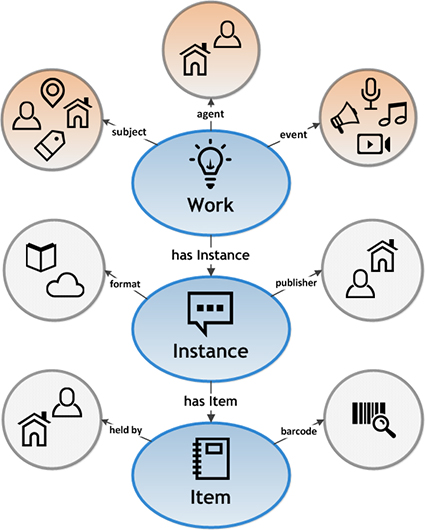

Heute standen die Metadatenstandards in Bibliotheken auf dem Programm. Dabei haben wir u.a. MARC21 (ein vom Library of Congress entwickelter Standard für Bibliotheken) und Dublin Core (ein Metadatenschema zur Beschreibung von elektronischen Ressourcen, das auch ausserhalb der Bibliothekswelt genutzt wird) genauer betrachtet. In einem zweiten Teil haben wir die Möglichkeiten und Funktionalitäten der Open-Source Bibliothekssoftware "koha" getestet.

**Was habe ich heute gelernt?**
Heute habe ich mich mit den Grundlagen von Bibliothekssystemen und den wichtigsten (Meta)Datenformaten, die zur Beschreibung von Medien genutzt werden, beschäftigt. Bibliothekssysteme bilden u.a. auf Grundlage der Metadaten der Medien(typen) technisch den Lebenszyklus der Medien ab. Zusätzlich soll ein Bibliothekssystem alle Geschäftsgänge einer Bibliohtek abbilden (wie z.B. die Erfassung neuer Nutzer:innen).
**MARC21**: MARC21 ist der am weitest verbreitete Metadatenformat-Standard in Bibliotheken. Dieser wurde Ende der 1990er Jahre von der Library of Congress entwickelt und beschreibt die Daten sehr detailliert. Im Bibliothekswissenschaftsteil des Moduls GLIW hatten wir das Format eingehender angeschaut, meine Erinnerungen daran sind allerdings verschwindend klein. Obwohl die Vorgaben des Standards sehr detailliert sind und Spezialwissen erfordern, variiert die Verwendung und Ausprägung der Felder und Unterfelder in der Praxis von Bibliothek zu Bibliothek aufgrund spezifischer "Hausregeln" sehr stark. Da der Standard medienzentriert aufgebaut ist, gibt es ausserdem keine Verlinkungen (z.B. Normdaten bei den Autor:innen), sondern Informationen wird x-fach wiederholt und muss gegebenenfalls an mehreren Stellen angepasst werden. Spannend fand ich hier den Hinweis auf das [Metadata Quality Assessment Framework von Péter Király](http://pkiraly.github.io), welches die Qualität von Metadaten in verschiedenen Katalogen von Institutionen aus technischer Sicht systematisch analysiert und vergleicht. 
**Dublin Core**: Im Gegensatz zu Marc21 kommt der Dublin Core Metadatenstandard mit nur gerade 15 Feldern aus. Diese Konzentration auf das Wesentliche sorgt für die Einfachheit des Standards, jedoch auf Kosten der Spezifität. Der Dublin Core wird allgemein für die Beschreibung elektronischer Ressourcen verwendet und ist über die Bibliothekswelt hinaus gebräuchlich. Die Verwendung dieses Standards ermöglicht somit die Anschlussfähigkeit und ist darum durchaus sinnvoll.
**Koha**: Im zweiten Teil des Nachmittags haben wir uns mit der Bibliotheks-Software "Koha" beschäftigt. Koha wurde im Rahmen eines Open Source Projekts entwickelt. Der Name entstammt der Sprache der Maori in Neuseeland und bedeutet Geschenk oder das, was man gegenseitig zum Gemeinsamen beiträgt. Die Software wird seit fast 25 Jahren kollaborativ entwickelt und darf über die GPL Lizenz verwendet und weiterentwickelt werden. 
Das System kann über verschiedene Demoversionen von lokalen Anbietern getestet werden, für den Unterricht wählen wir die Version auf dem Server von Admin Kuhn, einer Schweizer Firma. Nach einem Überblick der verschiedenen Konfigurationsmöglichkeiten (es sind deren viele!), probieren wir individuell die grundlegenden Funktionen (wie Erschliessung, Nutzererfassung, Ausleihe, Rückgabe) aus. Die Nutzung stellt sich dabei als intuitiv heraus, es ist jedoch besonders bei der Erschliessung...

**Was war für mich neu?**
Neu war für mich, dass das Datenmodell **BIBFRAME** (basierend auf RDF-Datenformat) in Zukunft MARC21 und co. ablösen wird. Dafür stellt die Library of Congress Skripte zur Konvertierung von MARC21-Formaten nach Bibframe zur Verfügung. Bibframe basiert auf Linked Data Modellen und ist damit zukunfts- und anschlussfähiger als die bestehenden bibliothekarischen Metadatenstandards.

**Open Source Software**: Obwohl wir im Studium schon in mehreren Zusammenhängen mit Open Source Systemenen in Kontakt gekommen sind, habe ich zum ersten Mal ein Tool resp. eine Plattform für die Prüfung der "Gesundheit" eines solchen Systems aufgrund verschiedener Parameter an die Hand bekommen. Über die Plattform [Black Duck Open Hub](https://openhub.net/p/koha)

Neu war für mich die detaillierte Auseinandersetzung mit dem Open Source Bibliothekssystem Koha. Dieses System muss auf einem Server gehostet werden und ist im Browser nutzbar. Wir haben grundlegende Funktionen wie die Erschließung einer Monographie, die Erstellung eines Benutzungskontos und die Ausleihe getestet. Zudem habe ich gelernt, dass es wichtig ist, bei Open Source Systemen die Community und deren Beiträge zu prüfen. Bei Koha ist dies über die Plattform OpenHub möglich.

### Wie habe ich die Aufgaben gelöst?
Die Aufgaben habe ich durch eine Kombination aus theoretischem Wissen und praktischen Tests gelöst. Zum Beispiel habe ich das MARC21-Format durch praktische Anwendungen besser verstanden. Die Tests mit Koha habe ich durch Anleitung und eigenständige Exploration durchgeführt. Dabei war die Prüfung der Community-Beiträge auf OpenHub sehr hilfreich, um die Unterstützung und Weiterentwicklung des Systems zu bewerten.

### Bin ich mit den Arbeitsaufträgen klar gekommen - was fiel leicht, womit hatte ich Schwierigkeiten?
Die Arbeit mit den Bibliothekssystemen fiel mir leicht, da ich bereits einige Erfahrung im Umgang mit solchen Systemen habe. Die Tests mit Koha waren größtenteils erfolgreich, jedoch funktionierte die Ausleihe in der gewählten Demoversion nicht. Eine Herausforderung war es, die Unterschiede zwischen den Datenformaten MARC21 und Dublin Core im Detail zu verstehen und deren Anwendungsmöglichkeiten zu vergleichen.

### Wo kann ich das Gelernte anwenden?
Das Gelernte kann ich direkt in meiner Arbeit mit Bibliothekssystemen anwenden. Die Kenntnisse über die verschiedenen Metadatenformate sind besonders wichtig für die Erschliessung und Verwaltung von Medien. Zudem bietet das Verständnis von Open Source Systemen wie Koha wertvolle Einblicke für zukünftige Projekte, insbesondere bei der Bewertung und Implementierung neuer Systeme.

### Was habe ich nicht verstanden?

### Welche (Zusatz-)Informationen fehlen mir, was ist noch offen?

Insgesamt hat diese Lerneinheit mein Verständnis für Bibliothekssysteme und Metadatenformate vertieft und mir neue Werkzeuge und Methoden an die Hand gegeben, die ich in meiner täglichen Arbeit anwenden kann.
